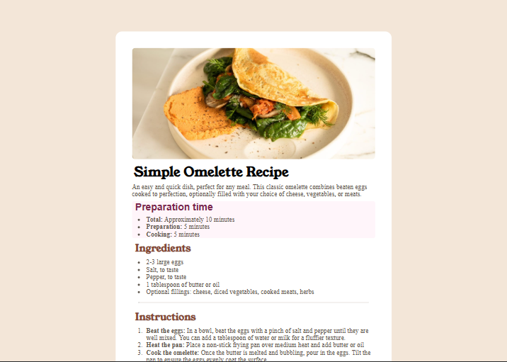

# Frontend Mentor - Recipe page solution

This is a solution to the [Recipe page challenge on Frontend Mentor](https://www.frontendmentor.io/challenges/recipe-page-KiTsR8QQKm). Frontend Mentor challenges help you improve your coding skills by building realistic projects.

## Table of contents

- [Overview](#overview)
  - [Screenshot](#screenshot)
  - [Links](#links)
- [My process](#my-process)
  - [Built with](#built-with)
  - [What I learned](#what-i-learned)
  - [Continued development](#continued-development)
- [Author](#author)

## Overview

### Screenshot



### Links

- Solution URL: [ https://camagu-mgadle.github.io/Recipe-page/](https://camagu-mgadle.github.io/Recipe-page/)
- Live Site URL: [https://mamasurecipe.netlify.app/](https://mamasurecipe.netlify.app/)

## My process

### Built with

- For markup used semantic HTML5 structure:
  - main
    - article
  - footer
- Used Flexbox Model
- Google Fonts:
  - [Young Serif](https://fonts.google.com/specimen/Young+Serif)

  - [Outfit](https://fonts.google.com/specimen/Outfit)

- CSS custom properties
  - @font-face

### What I learned

- Used an article element as a container instead of asimple div.

- Used section element to group the information:
  ```html
  <article>
    <section></section>
    <section></section>
    <section></section>
  </article>
  ```
- Also used the Table element:
  ```html
  <table>
    <caption>
      Info about the table
    </caption>
    <tbody>
      <tr>
        <th>table header</th>
        <td>table data</td>
      </tr>
    </tbody>
  </table>
  ```

### Continued development

- Understanding how to use HTML5 attributes for more accessible web content.
- For accessibility learn more about css attributes like aria-label.
- learn more about the table and its properties.

## Author

- Website - [Camagu](https://mgadleca.netlify.app/)
- Frontend Mentor - [@camagu](https://www.frontendmentor.io/profile/yourusername)
- LinkedIn - [@camagu](https://www.linkedin.com/in/camagu-mgadle/)
